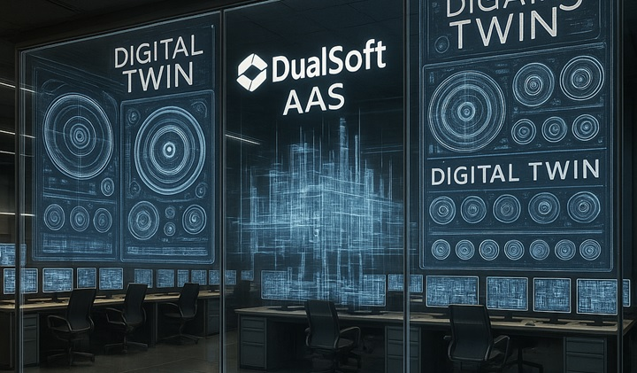

# DUALSOFT®

<figure><figcaption>
DUALSOFT AAS
</figcaption></figure>

듀얼소프트 AAS 기반 스마트 제조 혁신 소개

안녕하세요, DS를 방문해 주신 여러분을 진심으로 환영합니다.

DS는 끊임없는 혁신과 도전 정신으로 디지털 전환 시대에 맞는 스마트 제조 솔루션을 개발하고 있으며,&#x20;

특히 **국제표준 AAS(Asset Administration Shell)** 기반의 플랫폼 및 솔루션 개발에 선도적인 역할을 수행하고 있습니다.


**DS의 핵심 가치**

* **고객 만족 최우선**: 고객의 제조 현장 요구를 반영한 맞춤형 디지털 트윈 솔루션 제공
* **기술 기반 신뢰 구축**: 국제표준(AAS, IEC 63278-1)을 기반으로 한 자산 정보 모델링과 데이터 상호운용성 확보
* **창의적 문제 해결**: AAS Sequence Control Submodel 등 독자적 기술로 스마트 공장 구축 지원


<figure><figcaption>
출처 : The Asset Administration Shell (AAS) as the foundation for the Digital Twin in Industry 4.0
</figcaption></figure>

## **🎯** 듀얼소프트란?


&#x20;**DUALSOFT**(이하 'DS’로 표시)를 사용하여 어디서나 디지털 시스템을 만들고 실제 시스템과 연동하여 시스템을 운영할 수 있습니다.


<figure><figcaption>
AASX 기반 SEQ 정의를 중심으로 시뮬레이션부터 제어 모니터링까지 5단계 모드를 확장 가능
</figcaption></figure>

<figure><figcaption></figcaption></figure>

## Just Join us

### 홈페이지



### 유튜브



--
--