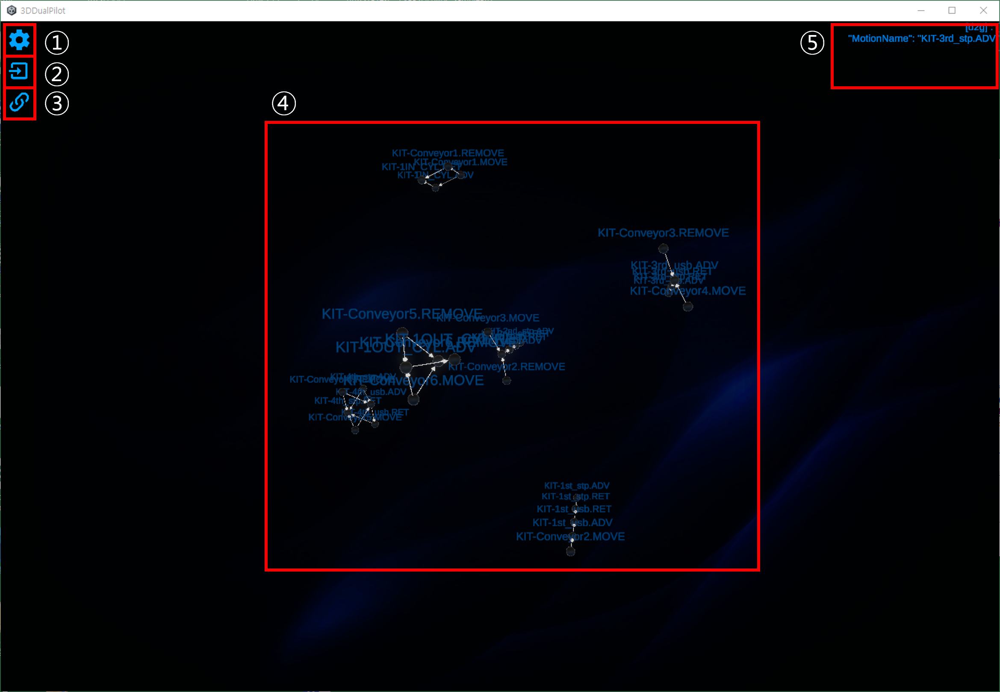

# DS 3D PILOT 매뉴얼


3D Pilot 소프트웨어는 Redis 서버를 사용합니다.


<figure><figcaption></figcaption></figure>

<figure><figcaption></figcaption></figure>

1. 설정: 노드 그래프와 설정 등의&#x20;
2. 수동 불러오기: DS mermaid .json 파일을 직접 불러서 노드 그래프를 생성합니다.
3. Redis 서버 재연결: DS PPT 시뮬레이터와 통신 및 노드 그래프를 불러오기 위해 Redis서버에 재접속 및 새로고침합니다.
4. 노드 및 그래프를 보여주는 화면입니다.
5. DS 시뮬레이터에서 보내는 Redis 메세지 내용입니다.

### 사용법

DS 프로젝트를 작성한 PPT에서 \[추가기능] > \[ Option] > \[H/W Setting] 을 선택해 팝업을 띄웁니다.

Runtime Mode를 VirtualLogic, Interface를 REDIS로 변경한 후 OK를 클릭합니다.

<figure><figcaption></figcaption></figure>

추가 기능에서 Play Language를 선택해 시뮬레이션을 실행합니다.&#x20;

<figure><figcaption></figcaption></figure>

이미 실행한 적이 있다면 아래와 같은 팝업이 뜨는데 OK를 선택하시면 됩니다.

<figure><figcaption></figcaption></figure>

DS 3D Pilot을 실행합니다. 이후 3번 Redis 재접속 및 새로고침 버튼으로 통신을 연결하고 DS프로젝트에 맞는 노드를 불러옵니다.

빠른 시작의 DS PPT 사용 방법을 참고해서 시뮬레이션을 작동하면 3D Pilot 도 같이 작동합니다.

<figure><figcaption></figcaption></figure>

### 시뮬레이션에서 Redis 서버를 찾을 수 없다는 경고

3D Pilot의 Redis 재접속 버튼을 누른 후 다시 시도합니다.

### 시뮬레이션 에러 발생 후 ERR CLEAR 를 했지만 진행이 되지 않을때

Work를 모두 리셋한     후3D Pilot의 Redis 재접속 버튼을 누르고 다시 시도합니다.

