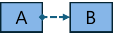

# 인과 연결선

도형간 인과를 연결하는 연결선의 종류는 다음과 같다.

<table><thead><tr><th width="115" align="center">기호</th><th width="137" align="center">명칭</th><th width="341.6666259765625" align="center">의미</th><th width="185.6666259765625" align="center">예시</th></tr></thead><tbody><tr><td align="center">
<figure><figcaption></figcaption></figure>
</td><td align="center">시작 인과</td><td align="center">A작업이 끝난 후 B작업 시작</td><td align="center">
<figure><figcaption></figcaption></figure>
</td></tr><tr><td align="center">
<figure><figcaption></figcaption></figure>
</td><td align="center">리셋 인과</td><td align="center">A작업 시작과 동시에 B작업이 리셋</td><td align="center">
<figure><figcaption></figcaption></figure>
</td></tr><tr><td align="center">
<figure><figcaption></figcaption></figure>
</td><td align="center">시작리셋 인과</td><td align="center">A가 끝나면 B시작과 동시에 A가 리셋</td><td align="center">
<figure><figcaption></figcaption></figure>
</td></tr><tr><td align="center">
<figure><figcaption></figcaption></figure>
</td><td align="center"> 인터락 인과</td><td align="center">서로의 작업에 의존하여 인터락 관계를 형성</td><td align="center">
<figure><figcaption></figcaption></figure>
</td></tr><tr><td align="center">
<figure><figcaption></figcaption></figure>
</td><td align="center">셀프리셋 인과</td><td align="center">A가 끝나면  A리셋</td><td align="center">
<figure><figcaption></figcaption></figure>
</td></tr><tr><td align="center">
<figure><figcaption></figcaption></figure>
</td><td align="center">그룹 인과</td><td align="center">그룹 내 모든 연결 노드 간에 동일 인과 적용</td><td align="center">
<figure><figcaption></figcaption></figure>
</td></tr></tbody></table>
