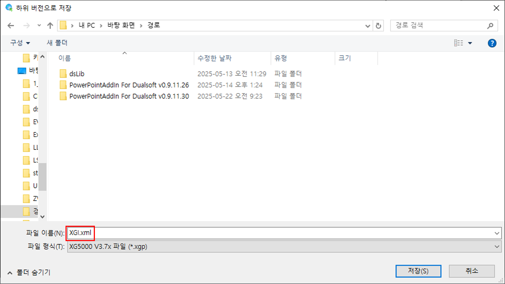
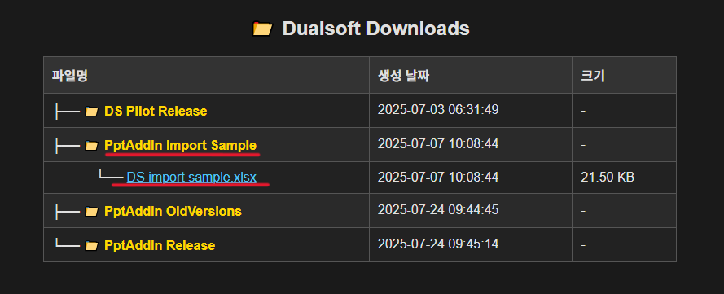
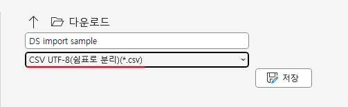
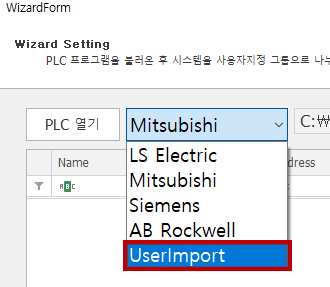
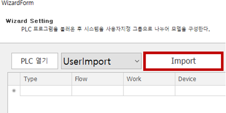
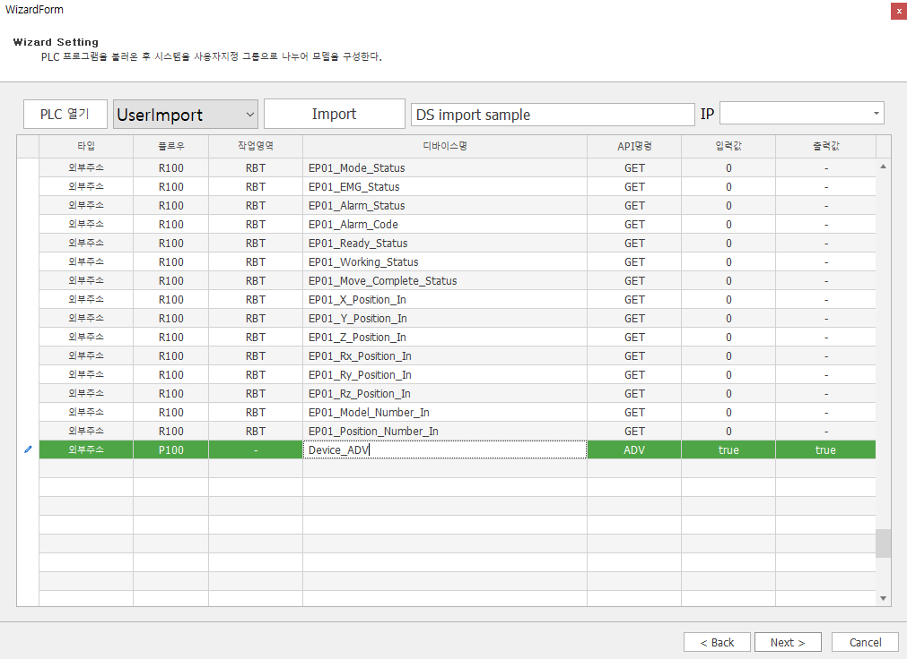
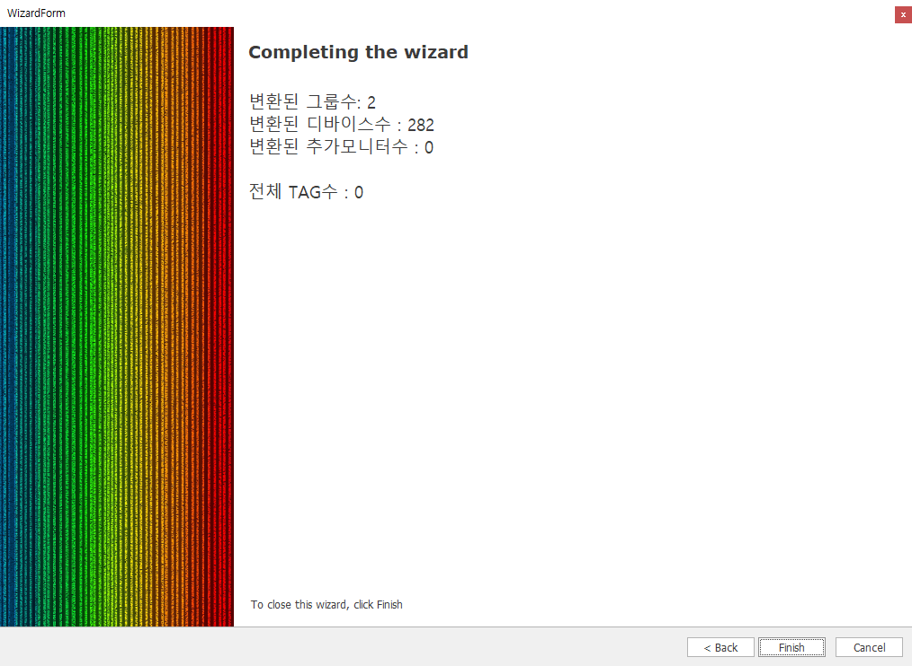

# DS WIZARD 매뉴얼


#### PLC 프로그램으로부터 디지털 공법 모델을 자동으로 생성하는 DS 마법사 사용 방법을 안내합니다.


> DS 마법사는 PLC 프로그램을 기반으로 DS 언어(DUALSOFT 시스템 언어)로 자동 변환하여 디지털 트윈 모델을 생성하는 도구입니다.
>
> ✅ 지원 PLC : LS, Mitsubishi (AB, Siemens 추후지원)\
> ✅ 지원 포맷 : 하위버전 저장 XML (예: XG5000 → .XML, Mitsubish → .CSV )

## 🧩 LS ELECTRIC

#### 📤 XG5000(LS ELECTRIC) 하위 버전 저장 방법 (이미지 참고)

1. **XG5000 실행 후 프로젝트 열기 또는 작성**
   * 기존 프로젝트를 열거나, 새로운 프로젝트를 생성합니다.
2. **상단 메뉴에서 \[프로젝트] 클릭**
   * 상단 툴바에서 **\[프로젝트(P)]** 메뉴를 클릭합니다.
3. **\[하위 버전으로 저장(E)] 클릭**
   * 메뉴 중간에 있는 **\[하위 버전으로 저장(E)]** 항목을 클릭합니다.
   * 해당 항목이 노란색으로 강조되어 있는 것이 이미지에서 확인됩니다.
4. **저장할 하위 버전 선택**
   * 팝업 창에서 대상 버전을 선택하고 저장 위치 및 파일명을 지정합니다.

<figure><figcaption></figcaption></figure>

5. 하위 버전으로 저장" 창이 뜨면, 원하는 경로와 파일 이름을 선택한 뒤, 확장자를 `.xml`로 변경하여 저장합니다.

<figure><figcaption></figcaption></figure>

***

## 2️⃣ DS Wizard 실행 방법

### ⓵ Step 1/4 – DS 마법사 실행

1. **PowerPoint를 실행한 후**, 상단 메뉴에서\
   \*\*\[추가 기능] > \[Ds Tools] > \[Utils] > \[DS Wizard]\*\*를 클릭합니다.
2. 아래와 같은 마법사 시작 화면이 나타납니다.

> DS 마법사는 PLC 프로그램을 기반으로 DS 언어(DUALSOFT 시스템 언어)로 자동 변환하여 디지털 트윈 모델을 생성하는 도구입니다.

<figure><figcaption></figcaption></figure>

<figure><figcaption></figcaption></figure>

***

### ⓶ Step 2/4 – PLC 파일 열기 및 대상 설정

1. **\[PLC 열기]** 버튼을 클릭하여\
   하위버전(XML)으로 저장한 XG5000 PLC 프로젝트 파일을 선택합니다.
2. 선택된 파일이 로드되면 다음 항목들을 확인합니다:
   * **모니터 대상** : 자동 감지된 주소 수
   * **IP 주소** : 실제 PLC 통신에 사용할 IP
   * **그룹 수** : 자동 계산 또는 수동 설정 가능

💡 XG5000에서는 반드시 **"하위 버전으로 저장"** 기능을 사용해 `.xml` 파일로 저장한 뒤 불러와야 합니다.

🔽 \[Next >] 버튼을 클릭합니다.

<figure><figcaption></figcaption></figure>

***

### ⓷ Step 3/4 – 그룹 시각화 및 수량 입력

1. 불러온 PLC 프로그램의 출력변수를 기반으로 **자동 그룹 분석 결과**가 색상으로 시각화됩니다.
2. 사용자 설정에 따라 \*\*\[그룹 수]\*\*를 직접 입력하거나 자동 설정 값을 유지합니다.

> 그룹은 출력변수 이름, 주소 범위 등을 기준으로 자동 구분되며,\
> 시각화된 색상으로 그룹 경계를 쉽게 확인할 수 있습니다.

🔽 그룹 확인 후 \[Next >] 버튼을 클릭합니다.

<figure><figcaption></figcaption></figure>

### 📘 보조 단계 – \[데이터 보기] 기능

* 위 그룹 시각화 화면에서 데이터 보기 체크박스를 활성화하면, 디바이스 그룹 및 태그 정보를 표 형태로 상세하게 확인할 수 있습니다.

#### 📋  주요 구성 항목

<table><thead><tr><th width="225" align="center">항목</th><th align="center">설명</th></tr></thead><tbody><tr><td align="center"><strong>디바이스 TAG 수</strong></td><td align="center">현재 불러온 태그 총 개수 (예: <code>9</code>)</td></tr><tr><td align="center"><strong>설정 그룹 수</strong></td><td align="center">사용자가 수동으로 지정한 그룹 수 (예: <code>10</code>)</td></tr><tr><td align="center"><strong>자동 그룹 수</strong></td><td align="center">분석된 결과에 따라 자동 분류된 그룹 수 (예: <code>5</code>)</td></tr><tr><td align="center"><strong>표 구성</strong></td><td align="center">Group, Name, Address 컬럼으로 구성된 디바이스 테이블 표시</td></tr></tbody></table>

<figure><figcaption></figcaption></figure>

***

### 📘 보조 단계 – 데이터 보기 및 필터 활용

* \[데이터 보기] 옵션을 켜면, 디바이스 태그를 테이블 형태로 확인하고, 모니터링 대상도 직접 선택할 수 있습니다.
* 또한 필터 기능을 활용하면 \*\*특정 조건(예: Device1\_ADV)\*\*에 해당하는 항목만 빠르게 추출할 수 있습니다.

#### 📋 주요 구성 항목

<table><thead><tr><th width="197" align="center">항목</th><th align="center">설명</th></tr></thead><tbody><tr><td align="center"><strong>Name</strong></td><td align="center">태그 이름 (<code>DrivePushBtn_I</code>, <code>EmergencyBtn_err</code> 등)</td></tr><tr><td align="center"><strong>Address</strong></td><td align="center">실제 PLC 주소 (%MX1006 등)</td></tr><tr><td align="center"><strong>MonitorUsed</strong></td><td align="center">해당 태그를 모니터링 대상으로 사용할지 여부 (체크박스)</td></tr><tr><td align="center"><strong>RowCount</strong></td><td align="center">전체 태그 수 표시 (예: <code>65</code>)</td></tr><tr><td align="center"><strong>사용 항목수</strong></td><td align="center">모니터링 대상으로 선택된 태그 수 (예: <code>65</code>)</td></tr></tbody></table>

<figure><figcaption></figcaption></figure>

#### 🔍 필터 기능 사용 예시

* 상단의 필터 박스를 이용하여 `Name Contains "err"`로 설정 시,\
  `ErrorLamp_O`, `EmergencyBtn_err`, `rxErrInterlock` 등 **에러 관련 태그**만 표시됩니다.
* 복수 태그를 한 번에 선택해 모니터링 설정 가능하며,\
  우측 체크박스로 일괄 선택 또는 개별 선택이 가능합니다.

> ☑️ 이 기능은 **조건 기반 디지털 공법 분석 및 시각화 대상 태그를 빠르게 지정**할 때 매우 유용합니다.

***

### ⓸ Step 4/4 – PPT 결과 생성 및 DS Pilot 실행

⓵ 마법사 완료 화면에서 다음 항목을 확인할 수 있습니다:

* 그룹 수, 디바이스 수, 출력 수
* 생성된 PPT 파일 경로

⓶ **\[Finish]** 버튼을 클릭하여 결과 파일을 생성합니다.

⓷ 생성된 PPT에는 디지털 공법 모델이 자동으로 시각화되어 있습니다.

⓸ 이후 `Dualsoft Setting` 창에서 DS Pilot을 실행할 수 있도록 설정합니다:

* CPU, IO 모듈, IP 주소 입력
* \[OK] 버튼 클릭하여 실시간 구동 가능

<figure><figcaption></figcaption></figure>

***

### 🧾 전체 흐름 요약

<table><thead><tr><th width="224.33331298828125" align="center">단계</th><th align="center">설명</th></tr></thead><tbody><tr><td align="center">⓵</td><td align="center">PowerPoint에서 DS Wizard 실행</td></tr><tr><td align="center">⓶</td><td align="center">PLC 프로그램 XML 파일 열기</td></tr><tr><td align="center">⓷</td><td align="center">출력변수 기반 그룹 자동 분석</td></tr><tr><td align="center">⓸</td><td align="center">디지털 공법 PPT 생성 및 DS Pilot 설정</td></tr></tbody></table>

## 🧩 UserImport

#### 📤 UserImport를 위한 `.csv`파일 저장 방법&#x20;

1.  **DualSoft** 사이트에서 **DS import sample.xlsx** 다운&#x20;

    * **dualsoft.com**에 접속하여 상단의 \[다운로드] 클릭 합니다.
    * 파일 목록 창에서 \[PptAddIn Import Sample] 클릭 합니다.
    * 하위 경로의 **DS import sample.xlsx** 파일을 다운 받습니&#xB2E4;**.**

    <figure><figcaption></figcaption></figure>

2. **DS import sample.xlsx** 편집

* **DS import sample.xlsx**의 양식에 맞춰서 정보를 기입합니다.&#x20;

<figure><figcaption></figcaption></figure>

3. **CSV** 파일로 저장

* \[다른 이름으로 저장] 선택합니다.
* 파일  경로와 파일 명을 선택한 후 확장자를 `.csv`로 선택한  후 저장합니다.&#x20;

<figure><figcaption></figcaption></figure>

## 2️⃣ DS Wizard 실행 방법

### ⓵ Step 1/4 – DS 마법사 실행

1. **PowerPoint를 실행한 후**, 상단 메뉴에서\
   &#xNAN;**\[추가 기능] > \[Ds Tools] > \[Utils] > \[DS Wizard]** 를 클릭합니다.
2. 아래와 같은 마법사 시작 화면이 나타납니다.

<figure><figcaption></figcaption></figure>

<figure><figcaption></figcaption></figure>

### ⓶ Step 2/4 – PLC 파일 열기 및 대상 설정

1. **\[PLC 열기]** 버튼 옆의   셀렉트 박스에서 **UserImport** 선택합니다.\
   \
    
2. **\[Import]** 버튼을  클릭하여  저장한  `.csv` 파일을  불러옵니다.\
   \
   \
   &#x20;
3. 선택된 파일이 로드 되면 다음 항목들을 확인합니다:
   * **타입**&#x20;
   * **플로우**&#x20;
   * **작업 영역**&#x20;
   * **디바이스명**&#x20;
   * **API명령**
   * **입력 값**&#x20;
   * **출력 값**&#x20;

<figure><figcaption></figcaption></figure>

💡 `.csv`파일은 "**DS import sample.xlsx**" 에서 주어진 양식에 맞게 저장한 뒤 불러와야 합니다&#x20;

🔽 \[Next >] 버튼을 클릭합니다.

### 📘 보조 단계 - Wizard 내에서 데이터 추가/삭제/수정 하기&#x20;

* 데이터를 추가 하고 싶다면 해당 표의 빈 행에 데이터를 추가 할 수 있습니다.
* 수정하고 싶은 부분을 클릭 한 후 수정 할 수 있습니다.&#x20;

<figure><figcaption></figcaption></figure>

* 삭제하고 싶은 행에 마우스 우클릭 후 **\[선택 행 삭제]**&#xB97C; 통해 원하는 행을 삭제 할 수 있습니다

<figure><figcaption></figcaption></figure>

* 우클릭 후 **\[csv저장]**&#xC744; 클릭하면 변경된 부분이 반영된 `.csv`파일을 저장 할 수 있습니다&#x20;

<figure><figcaption></figcaption></figure>

### ⓷ Step 3/4 – 그룹 시각화 및 수량 입력

1. 불러온 PLC 프로그램의 출력 변수를 기반으로 **자동 그룹 분석 결과**가 디바이스 그룹 및 태그 정보를 표 형태로 상세하게 확인할 수 있습니다&#x20;
2. 사용자 설정에 따라 **\[그룹 수]**&#xB97C; 직접 입력하거나 자동 설정 값을 유지합니다.

<figure><figcaption></figcaption></figure>

🔽 그룹 확인 후 \[Next >] 버튼을 클릭합니다.

### &#x20;📘 보조 단계 – \[이미지 보기] 기능

* 위 그룹 표 화면에서 이미지 보기 체크 박스를 활성화하면, 이미지 시각화  형태로 상세하게 확인할 수 있습니다.
* 시각화 된 색상으로 그룹 경계를 쉽게 확인할 수 있습니다.

<figure><figcaption></figcaption></figure>

🔽 Wizard Page Title에서는 바로 Next> 버튼을 클릭하여 넘어갑니다.

### ⓸ Step 4/4 – PPT 결과 생성 및 DS Pilot 실행

⓵ 마법사 완료 화면에서 다음 항목을 확인할 수 있습니다:

* 그룹 수, 디바이스 수, 출력 수, 전체 TAG 수&#x20;
* 생성된 PPT 파일 경로

⓶ **\[Finish]** 버튼을 클릭하여 결과 파일을 생성합니다.

⓷ 생성된 PPT에는 디지털 공법 모델이 자동으로 시각화되어 있습니다.

<figure><figcaption></figcaption></figure>

### 🧾 전체 흐름 요약

<table><thead><tr><th width="224.33331298828125" align="center">단계</th><th align="center">설명</th></tr></thead><tbody><tr><td align="center">⓵</td><td align="center">PowerPoint에서 DS Wizard 실행</td></tr><tr><td align="center">⓶</td><td align="center">셀렉트 박스에서 UserImport 선택</td></tr><tr><td align="center">⓷</td><td align="center">Import 버튼 누르고 .csv파일 열기</td></tr><tr><td align="center">⓸</td><td align="center">출력변수 기반 그룹 자동 분석</td></tr><tr><td align="center">⓹</td><td align="center">디지털 공법 PPT 생성 및 DS Pilot 설정</td></tr></tbody></table>
