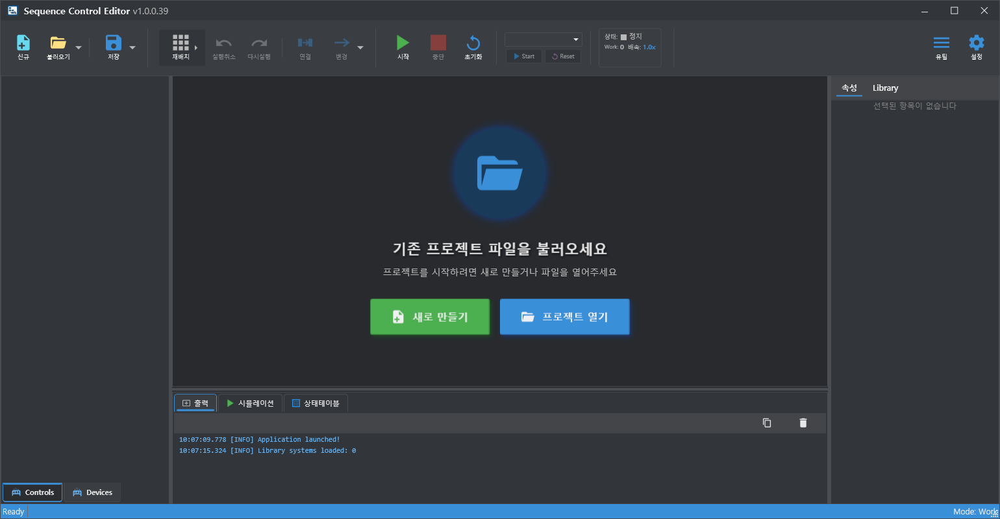

# 빠른시작

## Sequence Control Editor 다운로드 및 설치


먼저 아래의 페이지에서 소프트웨어를다운로드 후 설치해주세요.




듀얼소프트 파일 배포 센터에서 Setup Sequence Control (Editor) 를 다운로드합니다.
\
다운로드 버튼을 누르면 최신 버전을 받을 수 있습니다.

<figure><figcaption></figcaption></figure>

다운로드 받은 파일의 압축을 풀고 설치 마법사를 실행합니다.

<figure><figcaption></figcaption></figure>

Windows 디펜더에서 보호 알림이 뜨면 \[추가 정보]클릭 후 실행 버튼을 눌러 진행합니다.

<figure><figcaption></figcaption></figure> <figure><figcaption></figcaption></figure>

## 빠른 사용방법

**1. 프로젝트 생성**

Sequence Control Editor를 실행합니다.

새로 만들기를 클릭합니다&#x20;

<figure><figcaption></figcaption></figure>

프로젝트 명을 입력합니다&#x20;

<figure><figcaption></figcaption></figure>

<figure><figcaption></figcaption></figure>

**2. Flow 생성**

왼쪽의 프로젝트 이름 또는  프로젝트 캔버스에 마우스 우클릭을 합니다.&#x20;

**Flow 추가**를 클릭합니다 \
.png>)

<figure><figcaption></figcaption></figure>

Flow 추가 창에 Flow 이름을 입력합니다

<figure><figcaption></figcaption></figure>

<figure><figcaption></figcaption></figure>

**3. Work 생성**\
왼쪽의 Flow 이름 혹은  Flow 캔버스에 마우스 우클릭을 합니다. \
**Work 추가** 를 클릭합니다

<figure><figcaption></figcaption></figure>

<figure><figcaption></figcaption></figure>

Work 추가 창에 Work 이름을 입력합니다

<figure><figcaption></figcaption></figure>

<figure><figcaption></figcaption></figure>

**3. Action 생성**

왼쪽의 Work이름 혹은  Work 캔버스에 마우스 우클릭을 합니다. \
**Work 추가** 를 클릭합니다

